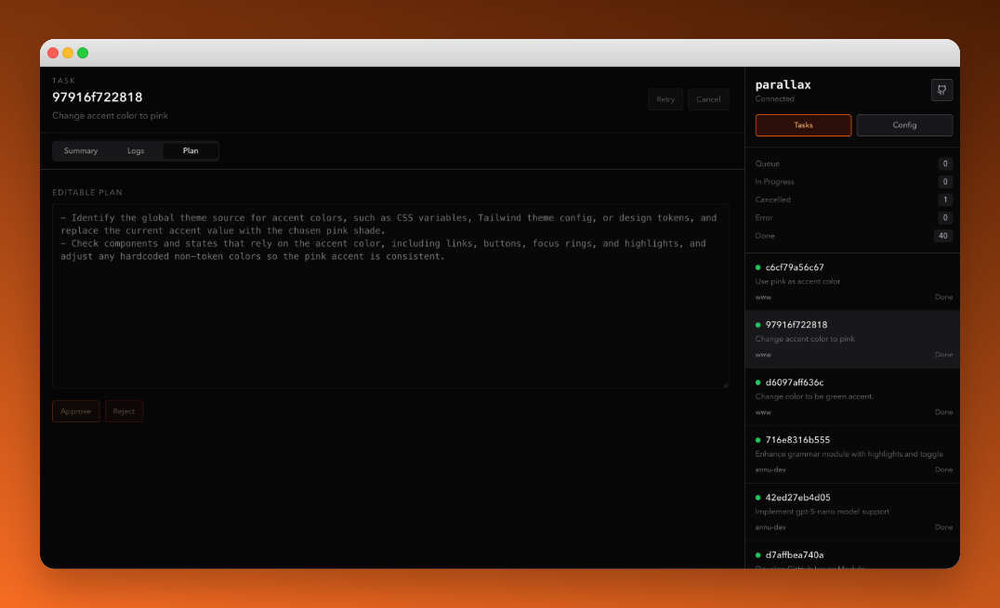

# parallax-cli

> WARNING: Parallax is currently in alpha. Expect rough edges, missing polish, and occasional breaking changes.

Parallax is a local AI orchestration runtime for software tasks.
It pulls work from Linear or GitHub, creates isolated worktrees, runs an agent in two phases (`plan` then `execute`), and requires explicit approval before implementation.



## First version scope

- Plan-first task lifecycle with explicit approval/rejection.
- Issue intake from Linear and GitHub.
- Global runtime state under `~/.parallax`.
- CLI onboarding wizard plus dashboard UI.
- Codex, Gemini, and Claude Code adapters (configurable per project).
- Named agents with system prompts and per-label routing.
- Slack bot for plan approvals and task notifications (Socket Mode, no public URL needed).

## Requirements

- Node.js `>= 23.7.0`
- `pnpm` `10.x`
- `git`
- `gh`
- at least one supported agent CLI (`codex`, `gemini`, or `claude`)

## Local development setup

```bash
pnpm install
pnpm parallax preflight
pnpm test
pnpm build
```

## Install global CLI

```bash
npm i -g parallax-cli
parallax preflight
```

## First-time setup

Run the interactive setup wizard:

```bash
parallax init
```

The wizard collects:
- Project ID and path to your local git repository
- Issue source (GitHub or Linear) and filter settings
- AI agent (Claude Code, Codex, or Gemini)
- Slack notifications (optional)
- API secrets (Linear key if needed)

Configuration is stored in `~/.parallax/config.json`. Projects and integrations can also be managed from the dashboard UI.

## Starting Parallax

```bash
parallax start
parallax open        # opens the dashboard in your browser
parallax status      # check health + running projects
parallax stop
```

## CLI

```bash
parallax --version
parallax init                                               # first-time setup wizard
parallax start [--server-api-port <port>] [--server-ui-port <port>] [--concurrency <count>]
parallax stop
parallax status
parallax open
parallax preflight
parallax pr-review <task-id>
parallax retry <task-id>
parallax cancel <task-id>
parallax logs [--task <id>]
```

## Slack bot

Parallax can connect to a Slack workspace using Bolt Socket Mode. When configured, it posts plan-ready notifications with Approve and Reject buttons directly in Slack, posts PR and failure events, and responds to a `/parallax` slash command for retry, cancel, status, and pr-review. Because Socket Mode uses an outbound WebSocket, no public URL is required — it works on localhost and behind NAT.

Configure Slack during `parallax init` or via the **Integrations** tab in the dashboard.

See [docs/slack-bot.md](docs/slack-bot.md) for the full setup guide.

## Dashboard

The dashboard is a four-section UI accessible at `http://localhost:8080` (default):

- **Tasks** — live task list with plan approval and log streaming
- **Projects** — add, edit, and delete project configurations
- **Integrations** — configure GitHub, Linear, and Slack
- **Secrets** — manage runtime environment variables (API keys, tokens)

## Runtime behavior

1. Pull eligible tasks from provider filters.
2. Generate plan text and persist it.
3. Wait for explicit plan approval from UI, CLI, or Slack.
4. Execute only approved plan steps.
5. Open/update PR and move task lifecycle state.

## Publish Global CLI (`parallax-cli`)

Parallax is published as a single global CLI package:

```bash
npm i -g parallax-cli
```

Releases are published through the manual GitHub Actions workflow:

- open the `Release parallax-cli` workflow in GitHub Actions
- trigger it with `Run workflow`
- the workflow publishes the exact version already set in [`packages/cli/package.json`](packages/cli/package.json)

Before triggering the release, update the version in `packages/cli/package.json`.

Default runtime locations and ports:

- runtime state: `~/.parallax`
- API: `http://localhost:3000`
- dashboard: `http://localhost:8080`

## Development

See [CONTRIBUTING.md](CONTRIBUTING.md).

## Documentation

For full user guides, see [docs/README.md](docs/README.md).

## License

MIT. See [LICENSE](LICENSE).
